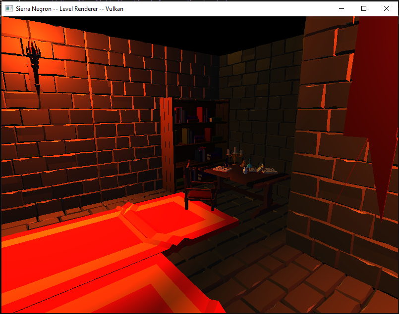

# About
This renderer parses custom text files to load and display multiple 3D models in different locations.

## Camera
Mouse movement to look around the scene

W- Forward  
A- Left  
S- Down  
D- Right  
Shift- Down  
Space- Up  

## Change Level
F1 - Switch between either level

## Music 
F2 - Pause background music  
F3 - Resume background music  

## Sample Image

